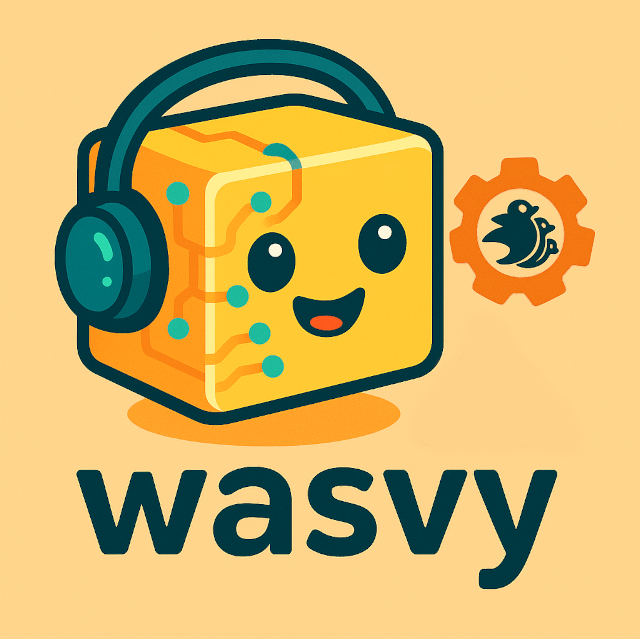

<div align="center">



</div>

# 🚧 Wasvy - Bevy WASM Integration (Alpha) 🚧

[](https://crates.io/crates/wasvy)
[](https://docs.rs/wasvy)
[](https://github.com/EngoDev/wasvy/blob/main/LICENSE)
[](https://www.rust-lang.org)

> ⚠️ **ALPHA WARNING**: This project is currently in a proof of concept stage. The API is unstable and may change significantly in future releases. Use at your own risk.

> 🎯 **Community Feedback**: I'm publishing this crate at this very experimental stage to get as much feedback as possible from the community. Together, we can shape this into something great! Your ideas, suggestions, and contributions are highly valued :)

> 💡 **TIP**: Check out the [`justfile`](justfile) for useful commands and as a reference for common operations in the project.

## Overview

Wasvy is an experimental integration between Bevy and WebAssembly (WASM), enabling the execution of WASM components within Bevy applications. This project aims to provide a seamless way to extend Bevy applications with WASM-based plugins and components.

## Vision

The ultimate goal of Wasvy is to create a vibrant ecosystem where:

- Game developers can easily make their games moddable with minimal boilerplate
- Modders can write mods in their language of choice (Rust, Python, etc.)
- Mods are sandboxed and safe to run
- The modding experience is as smooth as native code
- The ecosystem is vibrant with shared components and tools

## Features

- 🔌 WASM Component Model integration with Bevy
- 🎮 WASI support for WASM components
- 📦 Easy component loading and management

## Installation

Run the following command in your project directory:

```bash
cargo add wasvy
```

## Quick Start

```rust
use bevy::prelude::*;
use bevy::{DefaultPlugins, app::App};

// Get started by importing the prelude
use wasvy::prelude::*;

fn main() {
    App::new()
        .add_plugins(DefaultPlugins)
        // Adding the [`WasvyHostPlugin`] is all you need ;)
        .add_plugins(ModloaderPlugin::default())
        .add_systems(Startup, startup)
        .run();
}

/// Access the modloader's api through the Mods interface
fn startup(mut mods: Mods) {
    // Load one (or several) mods at once from the asset directory!
    mods.load("path/to/your/component.wasm");
}
```

## Creating Compatible Components

To create a WASM component that works with Wasvy, you'll need to use the WebAssembly Component Model and define your interfaces using WIT (WebAssembly Interface Types). Here's how to get started:

### Prerequisites

1. Install `cargo-component`:

```bash
cargo install cargo-component
```

2. Install `wkg` (WebAssembly Kit Generator):

```bash
cargo install wkg
```

### Creating a New WASM Component

1. Create a new component project:

```bash
cargo component new my-component --lib
cd my-component
```

2. Define your WIT interface in `wit/world.wit`. Here's a basic example:

```wit
package component:my-component;

world my-world {
    // For having access to ECS functions like register-component
    import wasvy:ecs/functions;

    /// This is important.
    /// This makes it so the WASM module must implement the guest required functions by the Bevy host.
    include wasvy:ecs/guest;

    use wasvy:ecs/types.{query-result};

    /// All systems must only have one argument of type `list<query-result>`
    export my_system: func(params: list<query-result>)
}
```

3. Configure `wkg` (Skip this if you already have it configured):

```bash
wkg config --edit
```

Then add the following line to your config:

```toml
default_registry = "wa.dev"
```

This will make `wkg` use `wa.dev` as the default registry, which is where Wasvy WIT files are stored.

4. Fetch the Wasvy WIT files from the registry:

```bash
wkg wit fetch
```

5. Build your component (This will also generate a `bindings.rs` file):

```bash
cargo component build --release
```

The resulting `.wasm` file will be in `target/wasm32-unknown-unknown/release/my_component.wasm`.

6. Implement your component in `src/lib.rs`. Check [`examples/simple/src/lib.rs`](examples/simple/src/lib.rs) for a full example:

```rust
#[allow(warnings)]
mod bindings;

use serde::{Deserialize, Serialize};
use bindings::Guest;

struct GuestComponent;

impl Guest for GuestComponent {
    fn my_system(params: Vec<bindings::QueryResult>) {
        println!("Hello from my WASM component!");
    }

    /// This is a mandatory function that is called once at Bevy `Startup` schedule
    fn setup() {}
}

bindings::export!(GuestComponent with_types_in bindings);
```

### Using the Component

1. Place your compiled `.wasm` file in your Bevy project's assets directory
2. Load it using the `WasmComponentAsset` as shown in the Quick Start example

### Tips

- Check out the examples in this repository for more detailed usage
- Use `wkg` to generate bindings for any additional Bevy features you need
- The WIT registry at [WebAssembly Components Registry](https://wa.dev/) contains many useful interfaces
- You can use `cargo component` to manage dependencies and build configurations

## Examples

Check out the examples directory for more detailed usage:

- [`examples/host_example`](examples/host_example): Basic example on how to use the crate to run WASM components.
- [`examples/simple`](examples/simple): Basic WASM component in Rust.
- [`examples/python_example`](examples/python_example): Basic WASM component in Python.

## Contributing

Contributions come in many forms, and I welcome all kinds of help! Here's how you can contribute:

### Code Contributions

1. Fork the repository
2. Create your feature branch (`git checkout -b feature/amazing-feature`)
3. Commit your changes (`git commit -m 'Add some amazing feature'`)
4. Push to the branch (`git push origin feature/amazing-feature`)
5. Open a Pull Request

### Non-Code Contributions

I am actively looking for:

- Feature suggestions and ideas
- Use case examples
- Documentation improvements
- Bug reports
- Design discussions
- Feedback on the API
- Modding workflow suggestions

You don't need to write code to help out! If you have an idea or suggestion, please:

1. Open an issue to discuss it
2. Share your thoughts in the discussions
3. Create a feature request

Please make sure to:

- Follow Rust coding standards (for code contributions)
- Add tests for new features (Not required for now, but will be appreciated)
- Update documentation as needed
- Keep the alpha status in mind when proposing changes

## Roadmap

### Phase 1: Core Integration (Current)

- [x] Basic WASM component loading
- [x] WASI support
- [ ] Component lifecycle management
- [ ] Parallel WASM system execution.
- [ ] Macros in Rust WASM components for making registring Bevy components and systems more ergonomic.
- [ ] Mutable query data in systems.
- [ ] Error handling improvements

### Phase 2: Enhanced Features

- [ ] Hot reloading support for WASM components
- [ ] Test suite
- [ ] Cross-component communication
- [ ] Performance optimizations
- [ ] Add javascript example
- [ ] Add go example

### Phase 3: Production Ready

- [ ] Comprehensive documentation
- [ ] Benchmarking suite
- [ ] Stable API

## Resources

- [WASM Component Model Documentation](https://component-model.bytecodealliance.org/introduction.html) - The best resource on WIT and how the WASM component model works in practicality.
- [Wasmtime Examples](https://github.com/bytecodealliance/wasmtime/tree/main/examples/component)
- [Component Model Examples](https://github.com/bytecodealliance/component-docs/tree/main/component-model/examples/example-host)
- [Cargo Component](https://github.com/bytecodealliance/cargo-component) - I used that for making the WASM component examples.
- [WASM Package Tools](https://github.com/bytecodealliance/wasm-pkg-tools) - How to publish and retreive WIT files for use in projects.
- [WebAssembly Coponents Registry](https://wa.dev/) - The WIT registry I'm using.
- [WASI.dev](https://wasi.dev/)

## License

This project is dual-licensed under either:

- MIT License ([LICENSE-MIT](LICENSE-MIT))
- Apache License, Version 2.0 ([LICENSE-APACHE](LICENSE-APACHE))

## Your contributions

Unless you explicitly state otherwise, any contribution intentionally submitted for inclusion in the work by you, as defined in the Apache-2.0 license, shall be dual licensed as above, without any additional terms or conditions.

## Acknowledgments

- [Bevy](https://bevyengine.org/) for the amazing game engine
- [Bytecode Alliance](https://bytecodealliance.org/) for all the amazing WASM tools
- [WebAssembly Coponents Registry](https://wa.dev/) - for providing a simple way to publish WIT components
