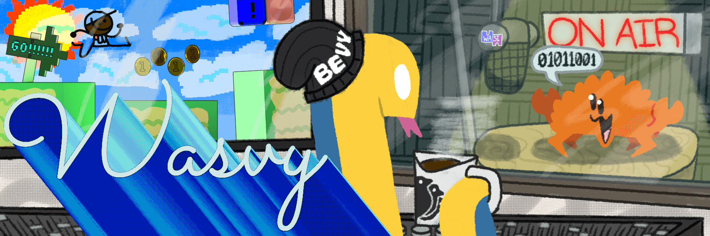

<div align="center">

</div>
<p align="right">Thanks <a href="https://pencartstudio.carrd.co">AreKayHen</a> for the lovely banner art!</p>

# Wasvy - WASI Modding for [Bevy](https://bevy.org/) (Just hatched! 🪺)

[](https://github.com/wasvy-org/wasvy#license)
[](https://crates.io/crates/wasvy)
[](https://crates.io/crates/wasvy)
[](https://docs.rs/wasvy)
[](https://www.rust-lang.org)
[](https://github.com/wasvy-org/wasvy/actions)
[](https://discord.com/channels/691052431525675048/1492230910383357992/1492230910383357992)

> 🪺 **Just hatched**: This project is in the process of stabilization. Some features are still missing and breaking API changes are likely to happen as we approach a 1.0 release. Use at your own risk!

> 🎯 **Community Feedback**: Your ideas, suggestions, and contributions are highly valued! Come and talk with us in the [Bevy Discord](https://discord.com/channels/691052431525675048/1492230910383357992/1492230910383357992). Report bugs and discuss new features on [Github](https://github.com/wasvy-org/wasvy/issues). Together, we can shape this into something great!

> 💡 **TIP**: Check out the [`justfile`](./justfile) for useful commands and as a reference for common operations in the project.

## Overview

Wasvy is an experimental Bevy modding engine, enabling the execution of WebAssembly (WASM) binaries within Bevy applications. It's powered by WebAssembly System Interface (WASI), enabling full access to the Bevy ECS, network, filesystem, system clock and more!

## Features

- 🪶 Easy integration: Just 2 lines of code!
- 🛠️ Devtools via the `wasvy` CLI: `cargo install wasvy_cli`
- 🔥 Hot reloading
- 🐍 Ready-made templates and support for any language that compiles to wasm!
- 🧩 Type safe, sandboxed, WASI components powered by [wasmtime](https://wasmtime.dev/)

## Installation

Install the `wasvy` CLI:

```bash
cargo install wasvy_cli
```

If you are developing rust mods, install the necessary target:

```bash
rustup target add wasm32-wasip2
```

Add the crate to your dependencies:

```bash
cargo add wasvy
```

## Quick Start

```rust,ignore
use bevy::prelude::*;
use bevy::{DefaultPlugins, app::App};

// Get started by importing the prelude
use wasvy::prelude::*;

fn main() {
    App::new()
        .add_plugins(DefaultPlugins)
        // Adding the [`ModLoaderPlugin`] is all you need 😉
        // And enable the devtools for CLI access ⚡
        .add_plugins(ModLoaderPlugin::default().devtools("My moddable Bevy app"))
        .run();
}
```

## Your first Mod

Start your app with Wasvy devtools enabled (shown above). Make sure to enable asset hot-reloading!

```bash
cargo run --features bevy/file_watcher
```

The `wasvy new` command helps creating new Mods. In another terminal, scaffold a new Rust mod:

```bash
wasvy new my-bevy-mod

# Or in another language, such as python (requires poetry)
wasvy new another-bevy-mod -l py
```

The `wasvy` CLI connects to your running Bevy app, and uses metadata such as the wit interfaces of your game to scaffold a new mod that is compatible.

Now, here comes the fun part! Let's build and load the mods you've created:

```bash
wasvy dev
```

If you make changes to your Mod's code, `wasvy dev` will automatically rebuild the Mod and instruct the game to load it!

## The CLI

Search for compatible mod sources within the current directory. Note that not all mods are compatible with all games.

```bash
wasvy list
```

Watch matching mods and reload them when their sources change:

```bash
wasvy dev --mods my-bevy-mod
```

Build and load a matching mod into the running app:

```bash
wasvy load --mods my-bevy-mod
```

Unload a matching mod:

```bash
wasvy unload --mods my-bevy-mod
```

Common options:

- `--path <PATH>`: search or create from a different directory. Defaults to the current directory.
- `--app <APP>`: require the connected devtools app name to contain this pattern.
- `--uri <URI>`: connect to an alternate remote address.
- `--mods <MODS>`: filter source names for `list`, `load`, `unload`, and `dev`.

For local development in this repository, you can use `just cli`

```bash
just cli search --path examples/mods
```

## Creating Mods from scratch

Mods are just compiled WebAssembly binaries using the wasvy wit interface (or your own).

`wasvy new` can help scaffolding new Mods, but it doesn't support all languages and use-cases. You can also create a mod manually by using the WebAssembly Component Model and defining your interfaces with WIT (WebAssembly Interface Types). Here's how to get started with a new mod written in Rust:

1. Create a new crate:

```bash
cargo new my-mod --lib
cd my-mod
```

2. Update your `cargo.toml`:

```toml
[package]
name = "my-mod"
version = "0.1.0"
edition = "2024"

[dependencies]
# Hassle-less codegen for wit
wit-bindgen = "0.58.0"

# Wasvy uses json for serializing components. We use serde instead
# of bevy_reflect since at the moment bevy-reflect bloats the wasm binary considerably
serde = "1.0"
serde_json = "1.0"

# Import any bevy-sub crates for any components you will be using
# Note: enable the serialize feature to allow using serde
bevy_transform = { version = "0.19.0", features = ["serialize"], default-features = false }
bevy_math = { version = "0.19.0", features = ["serialize"], default-features = false }

[lib]
crate-type = ["cdylib"] # necessary for wasm
```

3. Define your WIT interface in `wit/world.wit`. Here's a basic example:

```wit
package component:my-mod;

/// An example world for the component to target.
world example {
    /// This is the wit definition for wasvy's ecs access interface
    use wasvy:ecs/app.commands;

    /// An example system with a Commands system params
    export my-system: func(commands: commands);

    /// This is important.
    /// This makes it so the WASM module must implement the guest required functions by the Bevy host.
    include wasvy:ecs/guest;
}
```

4. Retrieve the Wasvy WIT files:

For the latest version (v0.0.8) download and add the [wit/\*.wit](https://docs.rs/crate/wasvy/0.0.8/source/wit/ecs/ecs.wit) file inside your wit folder manually like so (any file in this `deps` folder should be picked up during compile-time).


> Note: Due to [#40](https://github.com/wasvy-org/wasvy/issues/40), and with the addition of the Cli in [#60](https://github.com/wasvy-org/wasvy/pull/60), usage of `wkg wit fetch` pulling from https://wa.dev/wasvy:ecs is deprecated

5. Modify `my-mod/src/lib.rs` as shown:

```rust,ignore
wit_bindgen::generate!({
    path: ["./wit"],
    world: "component:my-mod/example",
    with: {
       "wasvy:ecs/app": generate,
    }
});
use wasvy::ecs::app::{App, Commands, Schedule, System};

struct MyMod;

impl Guest for MyMod {
    fn setup(app: App) {
        // This must match the system we have defined in world.wit
        // If you want more systems, just define more in wit
        let system = System::new("my-system");
        system.add_commands();

        // Register the system, similarly as you would in a Bevy App
        app.add_systems(&Schedule::ModStartup, vec![system]);
    }

    fn my_system(commands: Commands) {
        println!("Hello from my mod!");

        commands.spawn(&[
            ("example::Component".to_string(), "{}".to_string())
        ]);
    }
}

export!(MyMod);
```

5. Build your mod:

```bash
cargo build --target wasm32-wasip2 --release
```

The resulting `.wasm` file will be in `target/wasm32-wasip2/release/my-mod.wasm`.

Hint: The binary must be in your game's assets library for it to be visible to Bevy. By default this is `assets` in the same directory as `src`. Then, make sure to load it via [Mods::load](https://docs.rs/wasvy/latest/wasvy/mods/struct.Mods.html#method.load) as shown above (e.g. `mods.load("mods/my-mod.wasm")`).

## Examples

Want to see Wasvy in action? Start by running the `basic` app.

1. Clone this repo and [setup your dev environment].
2. Launch an app with a cube `just run basic`
3. In another terminal, Compile/Load compatible mods: `just cli dev`

In the [basic mod `lib.rs`](examples/mods/rust/basic/src/lib.rs), try altering the rotation direction of the cube.

### Apps

Wasvy offers some example host apps to get started:

- [**Basic**](examples/apps/basic): Demonstrates how to use the [`ModLoaderPlugin`](https://docs.rs/wasvy/latest/wasvy/plugin/struct.ModLoaderPlugin.html) and the devtools to enable modding with Bevy. This also serves as a good sandbox for testing your mods.
- [**Components**](examples/apps/components): A Bevy app that exposes component bindings in wit. This allows mods to directly call methods within the host to mutate components/resources.
- [**Custom Codec**](examples/apps/custom_codec): A Bevy app that demonstrates using a custom codec implementation for Wasvy.

### Mods

Since Wasvy is built on the wasm component model, mods can be written in almost any language. We provide a few examples for reference and experimentation:

- **Rust 🦀**
  - [**Basic**](examples/mods/rust/basic): Spins transforms with a `MyMarker` component. Spawns a custom component. Intended to be run with the [Basic example app](examples/apps/basic).
  - [**Components**](examples/mods/rust/components): A more complex WASM component with automatically generated bindings to invoke methods defined in the game on a component. Intended to be run with the [Components example app](examples/apps/components).
- [**Python 🐍**](examples/python_example): Spins transforms with a `MyMarker` component. Spawns a custom component. Intended to be run with the [Basic example app](examples/apps/basic).
- [**Go 🐹**](examples/go_example): Spins transforms with a `MyMarker` component. Spawns a custom component. Intended to be run with the [Basic example app](examples/apps/basic).

Don't see an example in your favorite language? **Consider contributing it to our repo!** See the guidelines below.

## Contributing

Contributions come in many forms, and we welcome all kinds of help! Here's how you can contribute:

### Setup your development environment

Using the project's [Nix flake](https://nixos.org/download/) is the simplest way to get a working development environment.

1. Install [Nix](https://nixos.org/download/).
2. Install [direnv](https://direnv.net/) and hook it into your shell by following the [official setup instructions](https://direnv.net/docs/hook.html).
3. From the repository root, allow direnv to load the flake-based development shell:

```sh
direnv allow
```

Once allowed, direnv will automatically enter the development shell for this repository and provision the required tooling.

### Other environments

If you are not using Nix, install the required tooling manually:

- Install [Rust 1.95.0+](https://www.rust-lang.org/tools/install)
- Install [`just`](https://github.com/casey/just)
- Run `just enable-git-hooks`

For additional project commands, see the [`justfile`](./justfile).

### Code Contributions

1. Fork the repository
2. Create your feature branch (`git checkout -b feature/amazing-feature`)
3. Commit your changes (`git commit -m 'Add some amazing feature'`)
4. Push to the branch (`git push origin feature/amazing-feature`)
5. Open a Pull Request

### Non-Code Contributions

We're actively looking for:

- Feature suggestions and ideas
- Use case examples
- Documentation improvements
- Bug reports
- Design discussions
- Feedback on the API
- Modding workflow suggestions

You don't need to write code to help out! If you have an idea or suggestion, please:

1. Open an issue to discuss it
2. Share your thoughts in the discussions
3. Create a feature request

Please make sure to:

- Follow Rust coding standards (for code contributions)
- Add tests for new features (Not required for now, but will be appreciated)
- Update documentation as needed
- Keep the alpha status in mind when proposing changes

## Roadmap

### Phase 1: Core Integration (Current)

- [x] Basic WASM component loading
- [x] WASI support
- [x] Parallel WASM system execution
- [x] Mutable query data in systems
- [ ] [System ordering](https://github.com/wasvy-org/wasvy/issues/18)
- [ ] [Entity/Component lifecycle management](https://github.com/wasvy-org/wasvy/issues/27)
- [ ] [Panic-free error handling](https://github.com/wasvy-org/wasvy/issues/28)

### Phase 2: Enhanced Features

- [x] Hot reloading wasm files
- [x] Seamless dev experience building mods with the `wasvy` CLI
- [ ] [Mod permissions](https://github.com/wasvy-org/wasvy/issues/22)
- [ ] Improved rust modding experience (See [wasvy-rust](https://github.com/wasvy-org/wasvy-rust))
- [ ] Improved python modding experience
- [ ] Add more languages + examples
- [ ] Test suite
- [ ] Cross-component communication
- [ ] Performance optimizations

### Phase 3: Production Ready (1.0!)

- [ ] Comprehensive documentation
- [ ] Benchmarking suite
- [ ] Stable API

## Resources

- [WASM Component Model Documentation](https://component-model.bytecodealliance.org/introduction.html) - The best resource on WIT and how the WASM component model works in practicality.
- [Wasmtime Examples](https://github.com/bytecodealliance/wasmtime/tree/main/examples/component)
- [Component Model Examples](https://github.com/bytecodealliance/component-docs/tree/main/component-model/examples/example-host)
- [Cargo Component](https://github.com/bytecodealliance/cargo-component) - I used that for making the WASM component examples.
- [WASM Package Tools](https://github.com/bytecodealliance/wasm-pkg-tools) - How to publish and retrieve WIT files for use in projects.
- [WebAssembly Components Registry](https://wa.dev/) - The WIT registry I'm using.
- [WASI.dev](https://wasi.dev/)

## License

This project (all code and files, excluding the assets directory) is dual-licensed under either:

- MIT License ([LICENSE-MIT](LICENSE-MIT))
- Apache License, Version 2.0 ([LICENSE-APACHE](LICENSE-APACHE))

The banner is by [AreKayHen, Copyright 2026](https://pencartstudio.carrd.co).

## Your contributions

Unless you explicitly state otherwise, any contribution intentionally submitted for inclusion in the work by you, as defined in the Apache-2.0 license, shall be dual licensed as above, without any additional terms or conditions.

## Acknowledgments

- [Bevy](https://bevyengine.org/) for the amazing game engine
- [Bytecode Alliance](https://bytecodealliance.org/) for all the amazing WASM tools
- [WebAssembly Components Registry](https://wa.dev/) - for providing a simple way to publish WIT components
